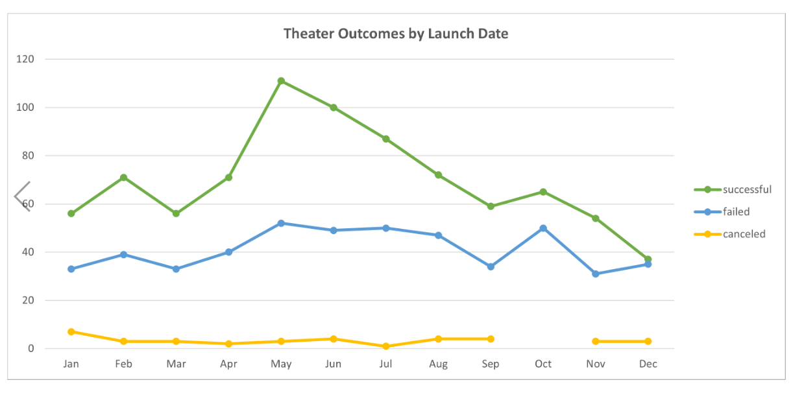
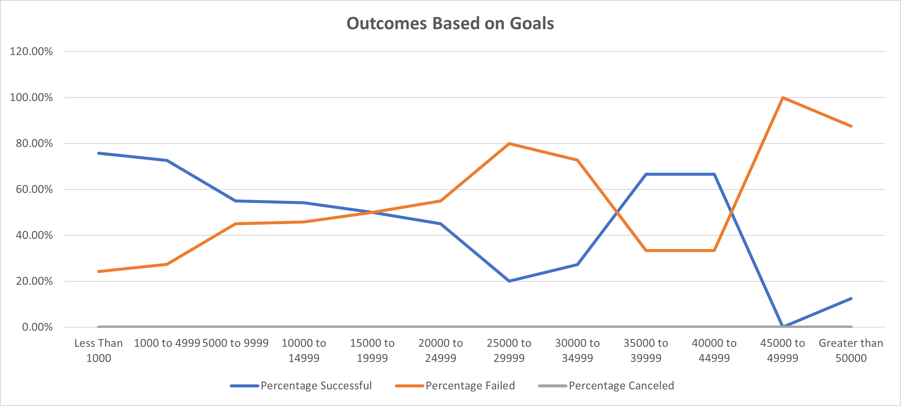

# Kickstarting with Excel

## Overview of Project

Louise’s play Fever came close to its fundraising goal in a short amount of time. Now, she wants to know how different campaigns fared in relation to their launch dates and their funding goals. Using the Kickstarter dataset we will visualize campaign outcomes based on their launch dates and their funding goals. We will then submit a written report based on our analysis and the visualizations we are going to create.

Over two billion dollars have been raised using the massively successful crowdfunding service, Kickstarter, but not every project has found success. Of the over 300,000 projects launched on Kickstarter, only a third have made it through the funding process with a positive outcome.

### Purpose

Using Excel, modify and analyze the data of 4115 Kickstarter projects in order to uncover market trends by examining funding processes and success rates.

## Analysis and Challenges

### Analysis of Theater Outcomes Based on Launch Date
Created pivot tables and graphing in Excel to visualize campaign outcomes ("successful," "failed," and "canceled") based on launch date. Also added a new column named "Years" which will be used for deriving the outcome based on Launch Date.
* After analysing the dataset I could conclude that more than 60% Therater campaign was successful .*
* Approximatley 40% campaign were failed and less than 5% of campaign got cancelled.
* I could also see the month of May and June has got maximum successful Theater outcomes.

### Analysis of Outcomes Based on Goals
Analysed the data to visualize the percentage of successful, failed, and canceled plays based on the funding goal amount. We will need to use a new function, COUNTIFS(), to collect the outcome and goal data for the “plays” subcategory.We have made a line chart based on the above filters.
*There is around 75% of successful plays campaign when the goal is below 5000.*
*There is no successful plays campaign in the goal range 45000-49999.*
*100% plays campaign failed in the goal range 45000.*
*There is no cancelled plays campaign.*

### Challenges and Difficulties Encountered

*Some information about the data set was hard to understand like the columns backers_count,Spotlight etc.*
*In the data sheet,"outcomes based on Goals",the goal amount 50000 was not included to count with the filter criteria which disturbed the data integrity. 

## Results

- What are two conclusions you can draw about the Outcomes based on Launch Date?

* There are more than 60% successful Theater campaign.*
*Theater is by far the most prevalent catagory which got maximum successful outout in the month of May.*

- What can you conclude about the Outcomes based on Goals?

*There is around 75% of successful plays campaign when the goal is below 5000.*
*100% plays campaign failed in the goal range 45000.*
*There is no cancelled plays campaign.*

- What are some limitations of this dataset?

Kickstarter was founded in 2009, making it a relatively new company. It might be useful to have data on metrics for consumer preferences or trust in Kickstarter over time.

There is evidence that this sample does not fully represent the population of Kickstarter campaigns. For example, the assignment’s instructions mention that only a third of Kickstarter campaigns make it through funding with positive outcomes, but this database shows that more than half of the programs selected are successful. Additionally, this sample includes quite a few Theater Kickstarter campaigns, but Kickstarter’s website does not identify Theater as the most common category.

Additionally, there are several outliers in the funding goal/target amounts of money for several categories/subcategories.

Lastly, the dataset does not have much information on what donors expect to receive in exchange for their donations.

- What are some other possible tables and/or graphs that we could create?

1.Table/graph showing successful or failed campaigns based on each Country.
2.Tables showing the most successful categories/subcategories versus the most unsuccessful categories/subcategories .
3.Tables showing the descriptive statistics like Mean,median,mode, max etc.
4.Displays showing the average timelines (how much time companies/organizations have to complete the Kickstarter campaigns) for the most successful and least successful types of programs.
5.Displays and tables that exclude significant funding goal outliers.

